  

  <em>Cybersecurity student by day. Threat hunter by night.</em> 
  <em>Builder of honeypots, breaker of assumptions.</em>

---

**WGU Cybersecurity B.S. (2027)** &nbsp;|&nbsp; CompTIA A+, Network+, Security+ *(in progress)* 
Currently: **Cybersecurity Intern** — Azure · GRC-focused 
I build things that catch hackers and document everything.

---

## Projects

### 🍯 Sable Saint-Claire & The Honeypots

A live SSH honeypot disguised as a Solana validator node. 17 Easter eggs. Real-time attack dashboard. Canary tokens. And one very glamorous gotcha moment. Currently collecting threat intelligence data from the open internet.

**[View Project →](https://github.com/jennafrank/the-honeypots)**

---

### 🖥️ Active Directory Home Lab

Built a full enterprise Active Directory environment from scratch. Dual-NIC domain controller, DHCP, NAT routing, DNS, and a PowerShell script that spun up 1,000 users automatically. This is what your corporate IT environment looks like under the hood.

**[View Project →](https://github.com/jennafrank/active_directory_home_lab)**

---

### ⚡ Brute Force SIEM Lab

Simulated brute force attacks and built detection rules in Azure Sentinel. Because knowing how attacks work is the first step to stopping them.

---

### 🌦️ API Automation Weather & Power Dashboard

Automated data pipeline pulling live weather and power management data. Built for efficiency, documented for clarity.

---

## Currently Learning

 
-FFD700?style=flat-square&labelColor=0d1117) 
-FFD700?style=flat-square&logo=microsoftazure&logoColor=white&labelColor=0d1117) 

---

## Connect

🌐 &nbsp;[JennaFrank.co](https://www.JennaFrank.co) 
💼 &nbsp;[LinkedIn](https://linkedin.com/in/jenna-frank-4352b12b0) 
📸 &nbsp;[Instagram](https://www.instagram.com/jennacfrank/)

---

  

---

  <em>"The quieter you become, the more you can hear."</em> 
  <em>— and the more attacks you can log. 💋</em>

