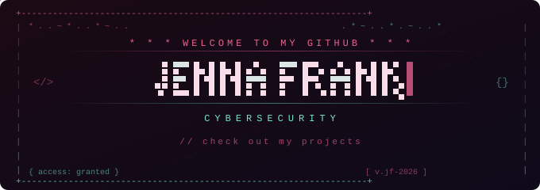

  

  <em>Cybersecurity Operations by day. Threat hunter by night.</em> 
  <em>Builder of honeypots, breaker of assumptions.</em>

---

**WGU Cybersecurity B.S. (2027)** &nbsp;|&nbsp; CompTIA A+, Network+, Security+ *(in progress)* 
Currently: **Security Operations Manager** - Built Pacific Watch, a SOC on the Log(N) Pacific cyber range. Threat hunting, Sentinel, KQL, MITRE ATT&CK. Hot Pink Huntress 💗

---

## Projects

---

### 🛡️ [Pacific Watch SOC](https://github.com/jennafrank/cyber-range-soc)

The advisory-only SOC I built and run on the Log(N) Pacific cyber range, where beginning analysts learn real SOC work. Detections flow through a Sentinel to Logic Apps to Jira pipeline I built, into Tier 1 and Tier 2 queues, with four-shift handoffs and a seven-value disposition taxonomy. About 50 builders and 15 leaders across six teams. Includes case studies, including the 316-case queue flood that became our detection build standard.

**[View Project →](https://github.com/jennafrank/cyber-range-soc)**

---

### 🎣 [INC-2026-87241: Cloud Identity Compromise & BEC](https://github.com/jennafrank/INC-2026-87241-EPIC-Investigation)

A full investigation of a Microsoft 365 account takeover. The attacker used legacy authentication to bypass Conditional Access, signed in 583 times with MFA satisfied zero times, ran Graph API reconnaissance, exfiltrated files, and sent a fraudulent payment request to the CFO. Persistence came from inbox rules and a Power Automate flow. Includes the timeline and 5 KQL detections.

**[View Project →](https://github.com/jennafrank/INC-2026-87241-EPIC-Investigation)**

---

### 🔬 [Pacific Watch Detection Engineering](https://github.com/jennafrank/pacific-watch-detection-engineering)

The Detection Build Card I wrote: the research-to-release standard every Pacific Watch detection follows, with working templates. The worked example grades my own first production rule against it: 66 requirements, 19 met, 24 partially met, 3 not met, 20 not recorded. Every local rule is traced to the thing that broke.

**[View Project →](https://github.com/jennafrank/pacific-watch-detection-engineering)**

---

### 🤖 JADEPUFFER: Agentic Ransomware Hunt

### Hunting an Autonomous AI Attacker in Microsoft Sentinel

One sentence of instruction. Seventeen minutes. Zero humans. I traced an LLM agent from an unauthenticated Langflow RCE (CVE-2025-3248) through credential theft, lateral movement, and a self-repaired exploit to 1,342 encrypted records across 4 hosts. Includes the KQL hunt queries, full MITRE ATT&CK mapping, and the four detection signals that separated the agent from normal noise.

**[View Hunt →](https://github.com/jennafrank/threat-hunt-agentic-ransomware)**
---

### 🏥 Healthcare Enterprise Honeynet

   

Production-grade two-node honeypot (Meridian HR + Cascade Medical EMR). Real-time SOC dashboard, 3,181 synthetic healthcare documents, threat hunting framework, and attacker behavior analysis.

**[View Honeynet →](https://github.com/jennafrank/healthcare-enterprise-honeynet)**

---

### 🍯 Sable Saint-Claire & The Honeypots

A live SSH honeypot disguised as a Solana validator node. 17 Easter eggs. Real-time attack dashboard. Canary tokens. And one very glamorous gotcha moment. 146 days of real attacker telemetry from the open internet (Apr 27 to Sep 21, 2026).

**[View Project →](https://github.com/jennafrank/the-honeypots)**

---

### ⚔️ Imperial STIG Strikes Back

   

Comprehensive Windows 11 STIG compliance remediation. 11 HIGH severity findings remediated through tactical PowerShell operations. 100 → 115 STIG items brought into compliance. Imperial Command's security hardening directive, fully executed.

**[View Campaign →](https://github.com/jennafrank/imperial-stig-strikes-back)**

---

## ⚔️ Empire Vulnerability Protocol

### Comprehensive Vulnerability Management Lifecycle

Policy governance, vulnerability detection, risk assessment, remediation operations, and verification closure. 81% vulnerability reduction achieved in the first cycle.

**[View Program →](https://github.com/jennafrank/vulnerability-management-empire)**

---

## 🎯 Threat Hunting & Security Operations

### Threat Hunt: Unauthorized TOR Network Access

Parallel threat hunting investigation documenting TOR browser detection via KQL queries, network telemetry analysis, and forensic timeline reconstruction.

**[View Investigation →](https://github.com/jennafrank/threat-hunting-tor-imperial)**

---

### 🖥️ Active Directory Home Lab

Built a full enterprise Active Directory environment from scratch. Dual-NIC domain controller, DHCP, NAT routing, DNS, and a PowerShell script that spun up 1,000 users automatically. This is what your corporate IT environment looks like under the hood.

**[View Project →](https://github.com/jennafrank/active_directory_home_lab)**

---

## Currently Learning

 
 
 
 
 

---

## Connect

🌐 &nbsp;[JennaFrank.co](https://www.JennaFrank.co) 
💼 &nbsp;[LinkedIn](https://linkedin.com/in/jenna-frank-cyber) 
📸 &nbsp;[Instagram](https://www.instagram.com/jennacfrank/)

---

  

---

  <em>"The quieter you become, the more you can hear."</em> 
  <em>— and the more attacks you can log. 💋</em>

